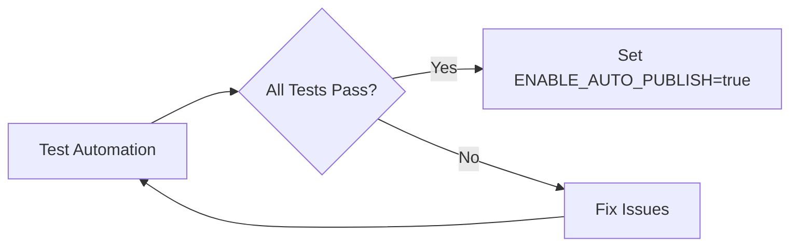
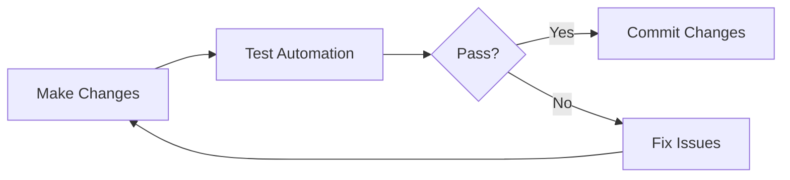

# Test Automation Workflow Guide

This guide describes how to use the Test Automation workflow to verify the complete release automation pipeline for RIPP Protocol.

## Overview

The Test Automation workflow (`.github/workflows/test-automation.yml`) provides comprehensive testing of the entire release and publish pipeline, including:

- **Release-Please Configuration**: Validates release-please setup and package configurations
- **VSIX Build Testing**: Tests VS Code extension builds and package creation
- **NPM Package Testing**: Tests CLI package builds and publishing readiness
- **Binary Build Testing**: Tests macOS binary generation for ripp-cli
- **Version Consistency**: Ensures versions are aligned across all files
- **Workflow Integration**: Validates that all workflows are properly configured
- **Dry-Run Publishing**: Tests publishing workflows without actually publishing

## When to Use

Run this workflow in the following scenarios:

1. **Before Enabling Auto-Publish**: Test the full pipeline before setting `ENABLE_AUTO_PUBLISH=true`
2. **After Configuration Changes**: Verify changes to release-please config, package.json, or workflows
3. **Before Major Releases**: Validate the pipeline is working correctly
4. **Troubleshooting**: Diagnose issues with the release automation
5. **Regular Audits**: Periodic checks to ensure pipeline health

## How to Run

### Via GitHub UI

1. Navigate to **Actions** tab in the repository
2. Select **Test Release Automation** workflow from the left sidebar
3. Click **Run workflow** button (top right)
4. Configure the test parameters:
   - **Test scenario**: Choose what to test (default: `full-pipeline-dry-run`)
   - **Target package**: Select which package to test (default: `both`)
   - **Verbose logging**: Enable detailed logs (default: `true`)
5. Click **Run workflow** to start

### Test Scenarios

#### 1. Full Pipeline Dry-Run (Recommended)

**Scenario**: `full-pipeline-dry-run`

Tests the complete release automation pipeline end-to-end:

- ✅ Release-please configuration validation
- ✅ VS Code extension VSIX build
- ✅ NPM CLI package build and tests
- ✅ macOS binary build
- ✅ Version consistency checks
- ✅ Workflow integration validation

**Use when**: You want to verify the entire pipeline is working correctly.

**Duration**: ~5-10 minutes

#### 2. Release-Please Only

**Scenario**: `release-please-only`

Tests only the release-please configuration:

- ✅ Config file validation
- ✅ Package configuration checks
- ✅ Workflow trigger validation

**Use when**: You've modified release-please config or want to quickly verify setup.

**Duration**: ~1 minute

#### 3. VSIX Build Only

**Scenario**: `vsix-build-only`

Tests only the VS Code extension build:

- ✅ TypeScript compilation
- ✅ Linting
- ✅ VSIX packaging
- ✅ Package validation
- ✅ Marketplace compliance checks

**Use when**: You've made changes to the VS Code extension or its build process.

**Duration**: ~2-3 minutes

#### 4. NPM Package Only

**Scenario**: `npm-package-only`

Tests only the NPM CLI package:

- ✅ Package build
- ✅ Test execution
- ✅ CLI functionality
- ✅ Binary build (macOS)
- ✅ Package content validation

**Use when**: You've made changes to ripp-cli or want to verify npm publishing readiness.

**Duration**: ~3-5 minutes

#### 5. Version Consistency Check

**Scenario**: `version-consistency-check`

Tests only version alignment:

- ✅ Release-please manifest vs package.json
- ✅ Package-lock.json versions
- ✅ Cross-package consistency

**Use when**: You've manually updated versions or need to verify consistency after changes.

**Duration**: ~30 seconds

## Understanding the Results

### Test Report

After the workflow completes, view the test report in the workflow summary:

1. Click on the completed workflow run
2. Scroll to the bottom to see **Test Automation Report**
3. Review the test results table showing pass/fail status for each component

### Job-Specific Results

Each test job provides detailed results in its own summary:

- **Test Release-Please**: Config validation and package setup
- **Test VSIX Build**: Extension build steps and VSIX validation
- **Test NPM Package**: Package build, tests, and CLI functionality
- **Test Binary Build**: macOS binary creation and execution
- **Version Consistency**: Version alignment across all files
- **Test Workflow Integration**: Workflow configuration validation

### Success Indicators

✅ **All Tests Passed**: The release automation is working correctly

- All version numbers are consistent
- Builds complete successfully
- Packages are ready for publishing
- Workflows are properly configured

❌ **Some Tests Failed**: Review the specific job logs to identify issues

- Check detailed logs for each failing job
- Fix the identified issues
- Re-run the workflow to verify fixes

## Safety Features

The Test Automation workflow includes several safety features:

### 1. Manual Trigger Only

The workflow runs **only** when manually triggered via `workflow_dispatch`. It will not automatically run on commits or PRs.

### 2. Dry-Run Mode

All publishing tests use dry-run mode:

- NPM publish uses `--dry-run` flag
- VSIX publishing is simulated, not executed
- No actual packages are published to registries

### 3. No Write Permissions

The workflow has minimal permissions:

```yaml
permissions:
  contents: read
  pull-requests: read
```

It cannot modify code, create tags, or publish releases.

### 4. Isolated Testing

All tests run in isolated environments:

- Fresh checkouts for each job
- No side effects on the repository
- Artifacts are temporary (7-day retention)

## Troubleshooting

### Common Issues

#### Version Mismatch Errors

**Problem**: Version consistency check fails

**Solution**:

1. Check `.release-please-manifest.json` versions
2. Ensure `package.json` versions match manifest
3. Run `npm install` to update `package-lock.json`

#### VSIX Build Failures

**Problem**: VSIX build job fails

**Solution**:

1. Check TypeScript compilation errors
2. Verify linting passes locally
3. Ensure `package.json` has valid version format (X.Y.Z)
4. Check that all required files are included

#### NPM Package Test Failures

**Problem**: NPM package tests fail

**Solution**:

1. Run tests locally: `cd tools/ripp-cli && npm test`
2. Fix failing tests
3. Verify CLI binary works: `node index.js --help`
4. Check package.json has correct `bin` configuration

#### Binary Build Failures

**Problem**: macOS binary build fails

**Solution**:

1. Verify pkg configuration in `package.json`
2. Check that schema files are included in assets
3. Ensure Node.js version compatibility (node20)

### Getting Help

If you encounter issues not covered here:

1. Review the detailed workflow logs
2. Check the individual job summaries
3. Open an issue with:
   - Workflow run link
   - Error messages from logs
   - Test scenario and parameters used

## Integration with Release Process

The Test Automation workflow complements the release process:

### Before Enabling Auto-Publish



1. Run **Test Automation** with `full-pipeline-dry-run`
2. Verify all tests pass
3. Set repository variable `ENABLE_AUTO_PUBLISH=true`
4. Merge changes to enable automatic releases

### During Development



1. Make changes to packages or workflows
2. Run appropriate test scenario
3. Fix any issues identified
4. Commit changes when tests pass

### Regular Audits

Run `full-pipeline-dry-run` periodically (e.g., monthly) to ensure:

- Pipeline still works correctly
- No configuration drift
- All dependencies are up to date
- Workflows are properly maintained

## Advanced Usage

### Testing Specific Packages

Use the `target_package` input to test specific packages:

- `both`: Test both VS Code extension and ripp-cli (default)
- `vscode-extension`: Test only VS Code extension
- `ripp-cli`: Test only ripp-cli

**Example**: Test only ripp-cli package

```yaml
test_scenario: version-consistency-check
target_package: ripp-cli
verbose_logging: true
```

### Verbose Logging

Enable `verbose_logging` for detailed output during testing:

- Full package contents
- Detailed validation steps
- Extended error messages

**Use when**: Troubleshooting issues or need detailed diagnostics.

### Combining with Manual Workflows

You can run Test Automation before manually triggering other workflows:

1. Run **Test Automation** (`full-pipeline-dry-run`)
2. Verify all tests pass
3. Manually trigger **Publish to VS Code Marketplace** or **Publish NPM Package**
4. Use `publish=false` or `dry_run=true` for safety

## Best Practices

1. **Test Before Merging**: Run test automation on feature branches before merging
2. **Use Appropriate Scenario**: Don't run full pipeline when a specific test is sufficient
3. **Review Reports Carefully**: Check all job summaries, not just the final status
4. **Fix Issues Promptly**: Don't let failing tests linger
5. **Document Changes**: Note any workflow or configuration changes in PR descriptions
6. **Regular Audits**: Schedule periodic full pipeline tests

## Related Documentation

- [Release Process](./CONTRIBUTING.md#release-process) - How releases work
- [Workflow Documentation](../.github/workflows/README.md) - All workflows
- [Release-Please Config](../release-please-config.json) - Version management
- [VS Code Extension](../tools/vscode-extension/README.md) - Extension docs
- [ripp-cli](../tools/ripp-cli/README.md) - CLI docs

## Maintenance

### Updating the Workflow

When modifying the test automation workflow:

1. Test changes in a feature branch
2. Run the workflow to verify it still works
3. Update this documentation to reflect changes
4. Get PR review before merging

### Adding New Tests

To add new test jobs:

1. Add job to `.github/workflows/test-automation.yml`
2. Include appropriate `if` conditions
3. Add result to final report in `generate-report` job
4. Update this documentation with new test description
5. Test the new job thoroughly

## Changelog

### v1.0.0 (Initial Release)

- Full pipeline dry-run testing
- Release-please configuration validation
- VSIX build testing
- NPM package build and testing
- Binary build testing (macOS)
- Version consistency checks
- Workflow integration validation
- Comprehensive test reporting

## Questions?

For questions about the Test Automation workflow:

- Open a [Discussion](https://github.com/Dylan-Natter/ripp-protocol/discussions)
- File an [Issue](https://github.com/Dylan-Natter/ripp-protocol/issues)
- Check [Contributing Guide](../CONTRIBUTING.md)
